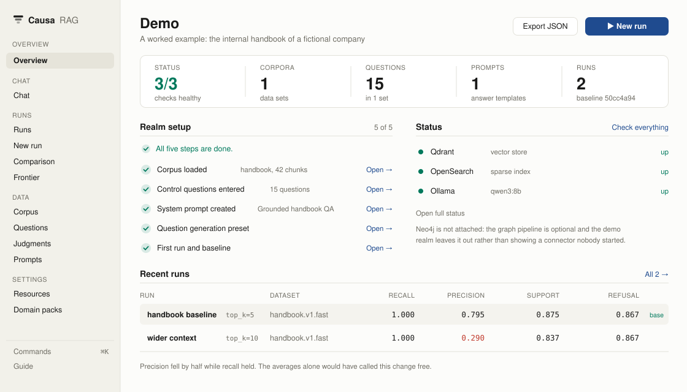
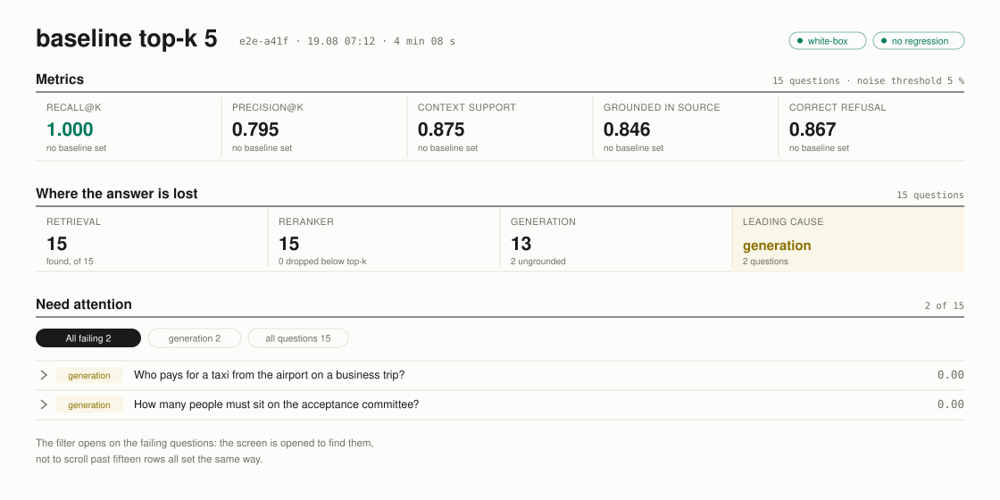
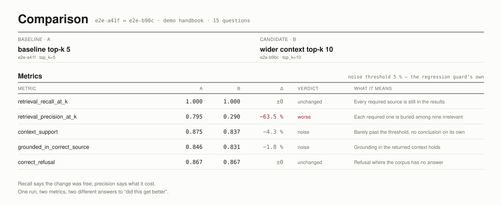
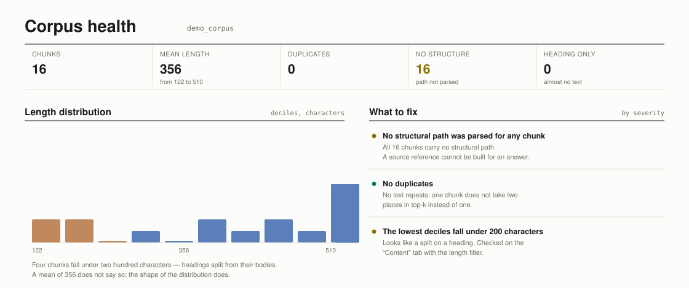

<div align="center">


### Shows which questions a change fixed, and which it broke.

A diagnostic bench for retrieval-augmented generation. It scores every question
in a golden set separately, names the pipeline stage that failed, and compares
two runs question by question so the effect of a change is visible instead of
assumed. Everything runs on your own machine.

[](LICENSE)
[](pyproject.toml)
[](https://github.com/laputski/causa-rag/actions/workflows/ci.yml)
[](https://doi.org/10.5281/zenodo.22117626)
[](#runs-entirely-on-your-machine)
[](https://ollama.com)
[](https://qdrant.tech)
[](https://opensearch.org)

</div>

<p align="center">
  
</p>

<p align="center">
  <sub>The overview screen of the demo realm that <code>./install.sh</code> creates.</sub>
</p>

<p align="center">
  
</p>

<p align="center">
  <sub>One run, read from the top: what it scored, where answers were lost, and which questions to look at.</sub>
</p>

<p align="center">
  
</p>

<p align="center">
  <sub>Real numbers, measured by <code>make test-e2e</code> over the demo corpus that ships with this repository.</sub>
</p>

<p align="center">
  
</p>

<p align="center">
  <sub>A corpus is judged by the shape of its length distribution, not by its mean.</sub>
</p>

---

## The problem

RAG systems are measured in averages and changed in bulk.

A configuration change that lifts the mean can break specific questions, and
the mean will not say so. Tools that report a score stay silent about which
stage failed, so a low number sends you to read logs rather than to a fix. And
almost every lever an operator has acts globally: changing the chunk size
rebuilds the index, swapping the embedder moves the whole vector space, editing
the system prompt changes every answer.

The result is a system that works on the day it ships and drifts afterwards,
where fixing one wrong answer risks breaking answers that already worked, and
regressions arrive as user complaints rather than as test failures.

## What Causa does

**Measures each question separately.** Retrieval recall and precision, answer
similarity, whether the answer is grounded in the source it cites, and whether
a question that should have been refused actually was.

**Names the stage that failed.** Retrieval, reranking or generation, decided
from the run's own trace. A source that retrieval found and the reranker
discarded is a different problem from one that was never found, and the two
call for different fixes.

**Compares two runs question by question.** Which questions improved, which
regressed, and which stayed the same. This is the view that makes the blast
radius of a change visible.

**Turns a reviewer's comment into reusable knowledge.** Free text becomes a
classified diagnosis and, on confirmation, a golden question that every later
run is measured against.

## Quickstart

```bash
git clone https://github.com/laputski/causa-rag && cd causa-rag && ./install.sh
```

The installer checks prerequisites first and reports everything missing at
once, then installs dependencies, starts the infrastructure, pulls models with
visible progress, starts the gateway, and seeds a demo realm. Re-running it is
cheap: each step checks whether its work is already done.

**Prerequisites**, all checked before anything is installed:

| | Why |
|---|---|
| Python 3.12+ | The gateway and the evaluation code |
| Docker with Compose v2 | Qdrant, OpenSearch, MongoDB, Redis, Langfuse |
| Node 18+ | The web interface (skip with `--no-ui`) |
| [Ollama](https://ollama.com/download) | Generation and LLM judging, on the host so it can use your GPU |

To see what is missing without installing anything:

```bash
./install.sh --check
```

When it finishes, open <http://localhost:5173>, pick the **Demo** realm and
press **New run**. It scores 15 questions over an eight-document handbook in
about a minute, and the result is a working example of every screen.

To check the state of a running install at any time:

```bash
make doctor
```

That reports each service, each model, the embedder weights, and, importantly,
whether the gateway silently fell back to stub components. A stub generator or
stub embedding vectors let the platform answer and produce numbers that mean
nothing, so those two rows are checked explicitly rather than inferred from a
green health endpoint.

## Running it day to day

The installer starts everything once. After that the pieces are separate, so
you can restart one without the others, watch its logs, and attach a debugger
to the gateway while the rest keeps running.

| Command | What it does |
|---|---|
| `make up` | Infrastructure, gateway and UI together, in the foreground |
| `make infra` | The Docker services alone: Qdrant, OpenSearch, MongoDB, Redis, Langfuse |
| `make api` | The gateway on port 8081, with the real embedder |
| `make ui` | The Vite dev server on port 5173 |
| `make stop` | Stop the gateway and UI the installer started |
| `make down` | Stop every container |
| `make ps` / `make logs` | Container status, and follow their logs |
| `make doctor` | What is running, what is missing, and what to type to fix it |
| `make demo` | Re-seed the demo realm |
| `make open` | Open all four web interfaces in a browser |

`make help` lists every target with a one-line description; the table above is
the subset you will use while working.

Running the gateway with `make api` puts it in the foreground of your own
terminal, which is what makes it debuggable: `Ctrl-C` stops it, a `breakpoint()`
in a router drops you into pdb, and `--reload` picks up an edit without a
restart. Point your editor's debugger at
`uvicorn services.api_gateway.main:app --port 8081` with `USE_REAL_BGE_M3=true`
set, and set breakpoints in `services/` or `core/` as usual.

Every service has its own web interface, so a failing run can be traced from
either end:

| | |
|---|---|
| <http://localhost:5173> | The platform |
| <http://localhost:8081/docs> | The gateway's own API, browsable and callable |
| <http://localhost:6333/dashboard> | Qdrant: collections and their contents |
| <http://localhost:3001> | Langfuse: the trace of a single question |

## What it is built on

Nothing here is exotic, and the list is short on purpose: every piece is one a
reader can already run and already knows how to inspect.

| Layer | Choice | Why this one |
|---|---|---|
| Gateway | Python 3.12, FastAPI, Pydantic v2, structlog | Async, typed at the boundary, structured logs with a trace id per query |
| Interface | React 18, Vite, TanStack Query, i18next | A dev server that reloads in milliseconds, and server state that refetches itself |
| Dense retrieval | [Qdrant](https://qdrant.tech) | Named vectors, payload filters, and a dashboard you can read without the platform |
| Sparse retrieval | [OpenSearch](https://opensearch.org) | BM25 with real language analysers, which matters once documents stop being English |
| Graph retrieval | [Neo4j](https://neo4j.com) with GDS, optional | Multi-hop traversal and community detection, behind the `graph` profile |
| Embeddings | [BGE-M3](https://huggingface.co/BAAI/bge-m3), 1024-dim, in-process | Multilingual and strong on both dense and sparse signals; loaded once, not called over the network |
| Reranking | Cross-encoder via sentence-transformers | Local by default, with a remote server as an option |
| Generation | [Ollama](https://ollama.com) | A local model with a GPU on the host, which is what makes the whole thing usable offline |
| Run history | MongoDB | Runs, prompts, datasets, judgments and per-realm settings |
| Embedding cache | Redis | Re-ingesting the same text should not pay for it twice |
| Tracing | [Langfuse](https://langfuse.com), self-hosted | Per-query traces, kept local like everything else |
| LLM judging | DeepEval, Ragas, TruLens | Three independent judges rather than one, because they disagree and the disagreement is informative |
| Local stack | Docker Compose | Six services, one file |
| Production | Helm chart | A starting point rather than a finished deployment |

Expect roughly 25 GB on disk after the first install, most of it model weights.
The three LLM judges live in their own `judges` extra and are skipped by
default, because resolving them together takes longer than everything else
combined; `./install.sh --with-judge` includes them, and `make test-eval` needs
them.

## How it differs

| | Per-question metrics | Stage-level cause | Paired run diff | Reviewer feedback back into the golden set | Runs locally |
|---|:---:|:---:|:---:|:---:|:---:|
| **Causa** | yes | yes | yes | yes | yes |
| Ragas, DeepEval, TruLens | yes | no | no | no | varies |
| RAGChecker | yes | partial | no | no | yes |
| Quepid, Rated Ranking Evaluator | yes | no | yes | yes | yes |
| Langfuse, Braintrust | traces | no | no | annotation only | varies |

The evaluation libraries compute metrics and report aggregates. The search
relevance tools work on ranking without generation. The tracing platforms
record what happened without running controlled experiments over a
configuration space. What Causa adds is the combination: a paired diff, a cause
attributed to a stage, and feedback that becomes a question the next run has to
answer.

## Which RAG systems it works with

Built and tested against **hybrid retrieval** (dense plus BM25 with reciprocal
rank fusion and a reranker) and **graph retrieval** (Neo4j, `pipeline_id=graph`).

Any RAG can connect over the HTTP contract, including one whose internals you
cannot see. Diagnostic depth follows what that system reports about itself: a
service that returns only an answer and its sources gets retrieval and answer
metrics, while per-stage attribution needs a per-stage trace. The contract
states which field unlocks which capability, and the platform says out loud
what it could not check rather than reporting a confident number over a gap.

The field-by-field reference is [docs/external-rag-contract.md](docs/external-rag-contract.md),
and [docs/connector-guide.md](docs/connector-guide.md) covers the Python SDK
route. Both exist in Russian under [docs/ru/](docs/ru/).

## Runs entirely on your machine

No document, question or answer leaves the host. Generation and judging use a
local Ollama, embeddings are computed in-process, and every store runs in your
own Docker. This was a hard requirement where the platform was built, and it
stays one.

## Layout

```
core/          evaluation, chunking, retrieval, diagnostics, the reference pipeline
adapters/      Qdrant, OpenSearch, Neo4j, Ollama, BGE-M3, external RAG over HTTP
services/      api_gateway (FastAPI), ingestion CLI, reference RAG server
domain_packs/  optional domain plugins; `manuals/` is the worked example
clients/       causa-rag-client, the Python SDK for connecting your own RAG
ui/            React interface
corpus/        the demo handbook
eval/          golden sets and the judge runners
tests/         unit, contract, integration, fitness, and the e2e walkthrough
```

## Tests

```bash
make test        # unit and contract, no services needed
make test-int    # integration, needs the stack up
make test-e2e    # the full walkthrough over the demo realm
```

The e2e suite is the one that matters most for trusting a fresh install: it
imports a realm, ingests the corpus, runs the golden set twice under different
configurations, compares them, records feedback and a judgment, and prints the
metrics it measured. It runs in an isolated realm and cleans up after itself.

## Contributing

Issues and pull requests are welcome. [CONTRIBUTING.md](CONTRIBUTING.md)
covers how to run the stack, which test layer to use for what, and how to add
an adapter, a domain pack or a locale.

The natural extension points are the component registry (chunkers, embedders,
retrievers, rerankers), domain packs, and the external-RAG HTTP contract.

## The map and the instrument

[**RAG World**](https://ragworld.org) is the sibling project: a self-updating
registry of retrieval-augmented generation technologies, where every maturity
level is derived from collected evidence by a deterministic rule and no language
model takes part. Its data is open, versioned and citable
([DOI 10.5281/zenodo.21943978](https://doi.org/10.5281/zenodo.21943978)).

The two answer different questions and neither substitutes for the other.
The registry says how mature a technique is and on what evidence, which is what
you need before choosing one. Causa says what state your own system is in and
what your last change broke, which is what you need after choosing.

A map, and an instrument. Both are built on the same principle: a claim is worth
what its evidence is worth, and a number without provenance is worse than none.
Both are citable: this one at
[DOI 10.5281/zenodo.22117626](https://doi.org/10.5281/zenodo.22117626), the registry at
[DOI 10.5281/zenodo.21943978](https://doi.org/10.5281/zenodo.21943978).

## Licence and author

Licensed under the [Apache License 2.0](LICENSE).

Copyright 2026 **Alexander Laputski**.
